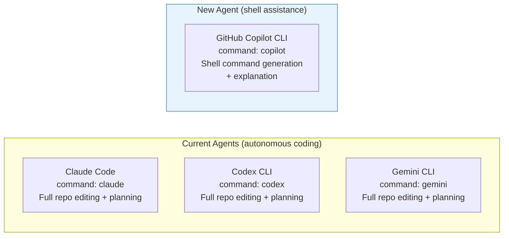
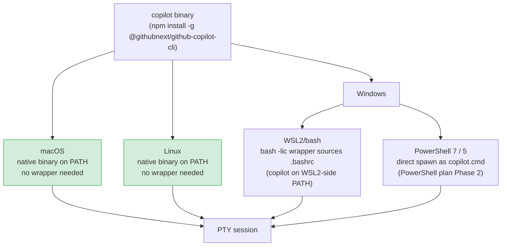
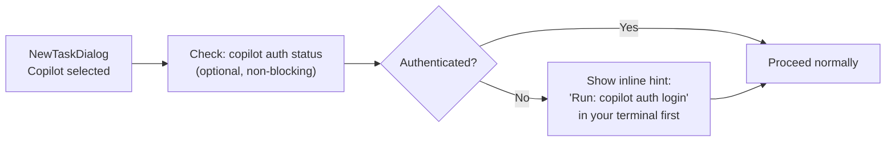
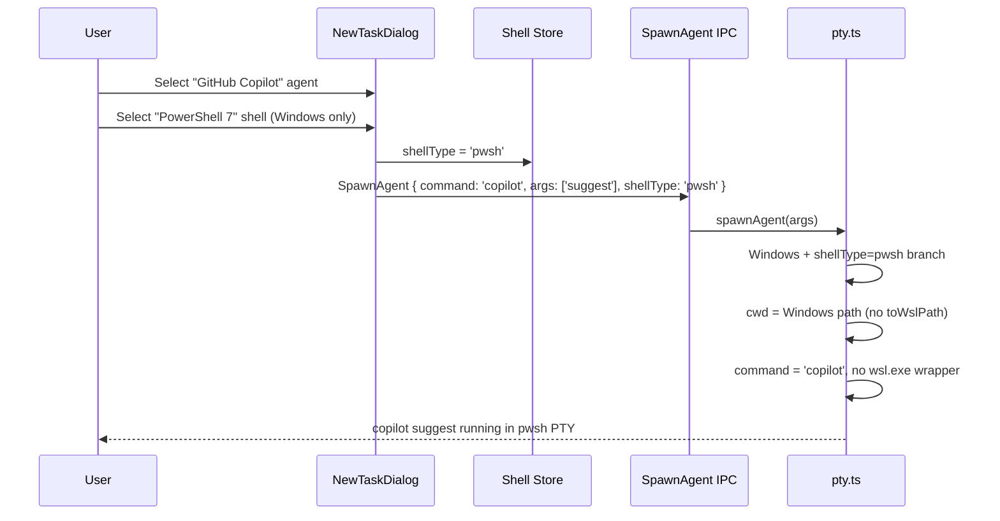

# GitHub Copilot CLI Agent — Implementation Plan

**Date:** 2026-03-01
**Depends on:**
- `2026-03-01-windows-powershell-evaluation.md`
- `2026-03-01-windows-powershell-plan.md`

## Overview

Add the standalone GitHub Copilot CLI (`copilot`) as an agent option in Parallel Code. `copilot` is a standalone binary — installed via npm just like `codex`, or as a system package — that runs natively on **macOS, Linux, and Windows** without requiring any intermediate tool. This makes it a first-class cross-platform agent available in bash (macOS/Linux/WSL2) and, once the PowerShell plan ships, in Windows PowerShell as well.

> **Scope note:** This plan uses the standalone `copilot` CLI binary directly (i.e. `command: 'copilot'`), consistent with how the other agents (`claude`, `codex`, `gemini`) are configured. It does **not** use the `gh copilot` GitHub CLI extension, which requires a separate `gh` installation and is a different invocation path.

---

## What is the Copilot CLI?

GitHub Copilot CLI is a standalone command-line agent installed via npm:

```sh
npm install -g @githubnext/github-copilot-cli
```

After installation, the `copilot` binary is available on PATH. It provides interactive, PTY-attached subcommands:

| Subcommand | Purpose |
|---|---|
| `copilot suggest` | Suggests a shell command for a natural-language task; asks follow-up questions and can execute the result |
| `copilot explain` | Explains what a given shell command does |
| `copilot what-the-shell` | One-shot: generate a command for a task, print it, optionally run it |

Authentication is performed once via `copilot auth login` (or the first-run wizard); credentials are stored in `~/.config/github-copilot/` on Unix and `%APPDATA%\GitHub Copilot\` on Windows.

---

## Agent Taxonomy



`copilot` occupies a distinct niche: it assists with **shell tasks** (find, transform, deploy commands) rather than autonomously editing source files. Both categories are useful in a multi-terminal workflow. The app's `AgentDef` structure supports this without any type changes — the `command` and `args` fields simply differ.

---

## Platform Support

`copilot` is a first-class agent on **all three supported OS environments**:



| Aspect | macOS | Linux | Windows (WSL2) | Windows (PowerShell) |
|---|---|---|---|---|
| Binary | `copilot` | `copilot` | `copilot` (in WSL2 distro) | `copilot.cmd` |
| Install | `npm i -g …` or Homebrew | `npm i -g …` | `npm i -g …` inside WSL2 | `npm i -g …` on Windows |
| Auth store | `~/.config/github-copilot/` | `~/.config/github-copilot/` | `~/.config/github-copilot/` (WSL2) | `%APPDATA%\\GitHub Copilot\\` |
| Works without WSL2? | Yes (N/A) | Yes (N/A) | Requires WSL2 | **Yes** |
| Copilot subscription | Yes | Yes | Yes | Yes |

macOS and Linux are the primary supported platforms with the simplest integration path — the binary is invoked directly, exactly like `claude`, `codex`, and `gemini`.

---

## Implementation

### 1. Add Copilot CLI to `DEFAULT_AGENTS`

**File:** `electron/ipc/agents.ts`

Add the Copilot CLI entry to the `DEFAULT_AGENTS` array:

```typescript
{
  id: 'copilot-cli',
  name: 'GitHub Copilot',
  command: 'copilot',
  args: ['suggest'],
  resume_args: [],                    // no resume concept for copilot suggest
  skip_permissions_args: [],          // no permissions model in copilot CLI
  description: "GitHub Copilot CLI — shell command suggestions and explanations",
},
```

No changes are needed to `AgentDef`, `IPC`, or the frontend agent-picker. The new entry flows through the existing `listAgents()` → `availableAgents` → `NewTaskDialog` pipeline automatically.

#### Spawning Behaviour Per Platform

```mermaid
flowchart TD
    Spawn["spawnAgent called\ncommand = 'copilot'\nargs = suggest"] --> Platform{process.platform}

    Platform -- darwin/linux --> UnixPath["Unix branch\npty.spawn 'copilot' suggest\ncwd = POSIX path\n(direct, no wrapper)"]

    Platform -- win32 --> ShellType{shellType}

    ShellType -- wsl2 --> WSL2Path["WSL2 branch\nwsl.exe --cd wslCwd --\nbash -lic 'exec \"$@\"' _ copilot suggest\n(sources .bashrc for copilot on PATH)"]

    ShellType -- pwsh/powershell --> PSPath["PowerShell branch (Phase 2)\npty.spawn 'copilot' suggest\ncwd = Windows path\nno WSL translation\nno bash wrapper"]

    UnixPath --> PTY[PTY session]
    WSL2Path --> PTY
    PSPath --> PTY
```

On macOS and Linux the binary is invoked directly with no platform-specific wrapping, exactly as `claude`, `codex`, and `gemini` are today.

On Windows (WSL2), the existing `bash -lic 'exec "$@"'` wrapper sources `.bashrc`, ensuring `copilot` is on PATH when installed inside the distro. On Windows (PowerShell), `copilot` resolves to `copilot.cmd` natively, so no wrapper is needed.

### 2. `copilot explain` as a Terminal Bookmark

Beyond the `AgentDef` entry for `suggest`, the `copilot explain` subcommand is best surfaced as a **terminal bookmark** rather than a dedicated agent. Users can add it to their project via the existing bookmark UI:

```
copilot explain <command>
```

No code changes are needed for this — the existing `TerminalBookmark` system handles arbitrary commands.

### 3. Authentication State Detection (Optional Enhancement)

When Copilot CLI is selected in the New Task dialog, the app can optionally pre-check whether the user is authenticated and show a setup hint if not. This is a best-effort UX improvement, not a hard gate.



**File:** `electron/ipc/agents.ts` — add an optional `checkCopilotAuth(shellType)` helper.

**File:** `src/components/NewTaskDialog.tsx` — display the hint inline under the Copilot option when the auth check fails.

The check must be **shell-aware**:
- macOS/Linux: run `copilot auth status` directly via `child_process.execFile`
- WSL2: run `wsl.exe -d <wsl-distro-name> -- copilot auth status` (distro name from `process.env.WSL_DISTRO`, set by `detectWsl()` in `electron/lib/wsl.ts`)
- PowerShell: run `copilot auth status` via PowerShell

### 4. Extended `AgentDef` for Shell-Aware Agents (Future)

As more agents gain shell-specific invocations (or are only available in one environment), consider extending `AgentDef`:

```typescript
// Future extension — not required for Copilot CLI v1
export interface AgentDef {
  id: string;
  name: string;
  command: string;
  args: string[];
  resume_args?: string[];
  skip_permissions_args?: string[];
  description: string;
  /** If set, agent only appears when one of these shell types is active. */
  supportedShells?: Array<'wsl2' | 'pwsh' | 'powershell' | 'native'>;
  /** Install hint shown when the binary is not found in PATH. */
  installHint?: string;
}
```

For the initial Copilot CLI implementation, the existing `AgentDef` is sufficient.

---

## Files to Create / Modify

### New Files

_None_ for the core implementation.

### Modified Files

| File | Change |
|---|---|
| `electron/ipc/agents.ts` | Add `copilot-cli` entry to `DEFAULT_AGENTS` |
| `electron/ipc/agents.ts` | _(optional)_ Add `checkCopilotAuth(shellType)` helper |
| `src/components/NewTaskDialog.tsx` | _(optional)_ Show auth hint when Copilot selected and auth check fails |

---

## Interaction with the PowerShell Plan

On macOS and Linux, `copilot` works immediately as soon as the `DEFAULT_AGENTS` entry is added. On Windows, it follows the same shell-branching logic as the PowerShell plan introduces:



---

## Testing Plan

| Test | Environment | Expectation |
|---|---|---|
| `listAgents()` returns `copilot-cli` entry | Unit | `id='copilot-cli'`, `command='copilot'`, `args=['suggest']` |
| Agent picker shows "GitHub Copilot" | Frontend | Card visible in NewTaskDialog on all platforms |
| `spawnAgent` with `command='copilot', args=['suggest']` | macOS | `copilot suggest` invoked directly, POSIX cwd |
| `spawnAgent` with `command='copilot', args=['suggest']` | Linux | `copilot suggest` invoked directly, POSIX cwd |
| `spawnAgent` with `command='copilot', args=['suggest'], shellType='wsl2'` | Windows/WSL2 | `wsl.exe ... bash -lic 'exec "$@"' _ copilot suggest` invoked |
| `spawnAgent` with `command='copilot', args=['suggest'], shellType='pwsh'` | Windows/PS | `copilot suggest` invoked directly in pwsh PTY, no wsl.exe |
| Auth check: `copilot` not installed | macOS/Linux | Inline install hint shown (optional feature) |
| Auth check: `copilot auth status` fails | Any | Inline auth hint shown (optional feature) |

---

## Rollout Sequence

1. **Now (no dependencies):** Add `copilot-cli` to `DEFAULT_AGENTS` in `electron/ipc/agents.ts`. Works immediately on macOS and Linux. Works on Windows via WSL2 if `copilot` is installed inside the distro.
2. **After PowerShell Phase 1–2:** `copilot` becomes available in Windows PowerShell terminals without any WSL2 dependency.
3. **Optional follow-up:** Add `checkCopilotAuth` helper and NewTaskDialog hint for first-time users.
4. **Future:** Extend `AgentDef` with `supportedShells` / `installHint` when more shell-aware agents are added.

---

## Open Questions

1. **`copilot suggest` vs `copilot explain` as separate agents:** Should `explain` be a second `AgentDef` entry, or is one entry for `suggest` sufficient? Recommend a single entry for now — `explain` can be invoked by typing in the terminal or added as a bookmark.

2. **Package name stability:** The npm package `@githubnext/github-copilot-cli` was under active development as of early 2026. Confirm the package name and binary alias at implementation time; if a stable `copilot` binary is distributed via another channel (e.g. direct download, Homebrew), the `command` value stays the same.

3. **Separate auth per shell on Windows:** A user installing `copilot` both inside WSL2 and natively on Windows will need to authenticate separately in each environment. A one-time setup wizard triggered on first Copilot use could surface this automatically.
