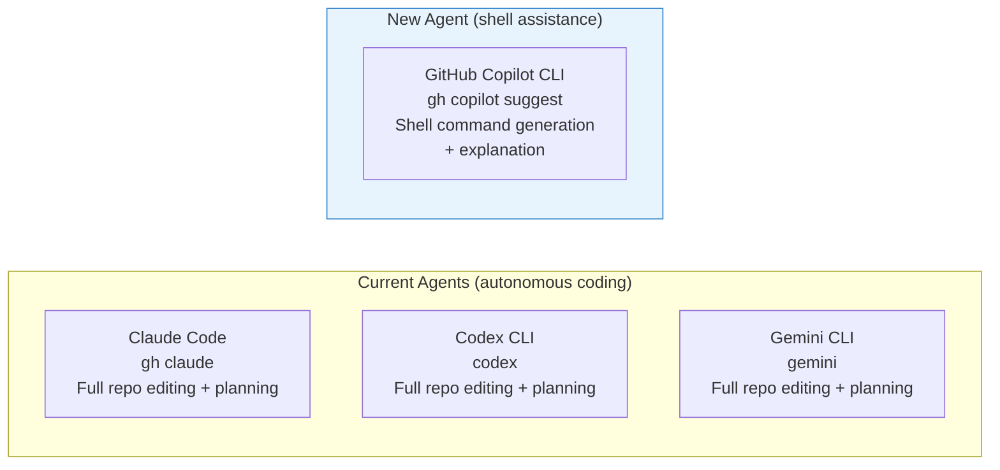
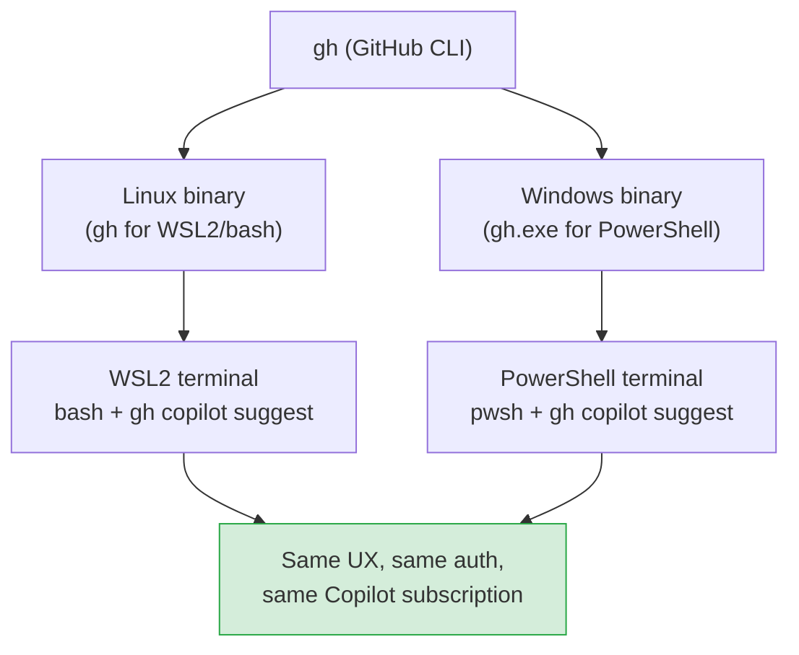
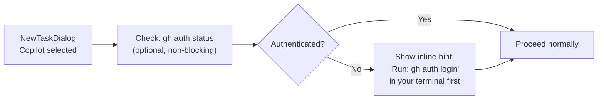
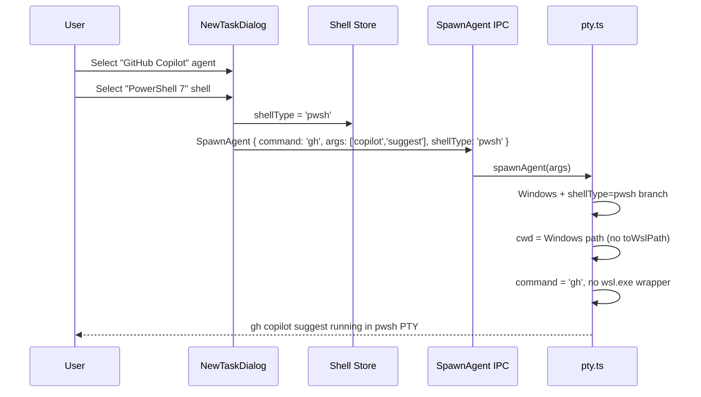

# GitHub Copilot CLI Agent — Implementation Plan

**Date:** 2026-03-01
**Depends on:**
- `2026-03-01-windows-powershell-evaluation.md`
- `2026-03-01-windows-powershell-plan.md`

## Overview

Add GitHub Copilot CLI (`gh copilot`) as an agent option in Parallel Code, available in both the existing WSL2/bash environment and the upcoming PowerShell environment (planned in the PowerShell implementation plan). Because `gh copilot` is distributed as a GitHub CLI extension that ships native binaries for both Linux and Windows, it is uniquely positioned to be the **first agent that works equally well in both shell environments** without any WSL2 dependency.

---

## What is GitHub Copilot CLI?

GitHub Copilot CLI is a GitHub CLI (`gh`) extension installed via:

```sh
gh extension install github/gh-copilot
```

It provides two primary interactive subcommands:

| Subcommand | Purpose |
|---|---|
| `gh copilot suggest` | Suggests a shell command for a natural-language task; asks follow-up questions and can execute the result |
| `gh copilot explain` | Explains what a given shell command does |

Both subcommands are interactive (PTY-attached) and work with the xterm.js terminal emulator already used in Parallel Code. Authentication is handled by the parent `gh auth login` flow; no separate credential setup is needed beyond a logged-in `gh` session.

---

## Agent Taxonomy

The app currently distinguishes between two agent types:



Copilot CLI occupies a distinct niche: it assists with **shell tasks** (find, transform, deploy commands) rather than autonomously editing source files. Both categories are useful in a multi-terminal workflow. The app's `AgentDef` structure already supports this distinction without any type changes — the command and args simply differ.

---

## Cross-Shell Compatibility

This is Copilot CLI's key advantage over the existing agents:



| Aspect | WSL2/bash | PowerShell (native Windows) |
|---|---|---|
| Binary name | `gh` | `gh` (resolves to `gh.exe` automatically) |
| Auth store | `~/.config/gh/` (WSL2 home) | `%APPDATA%\\GitHub CLI\\` |
| Separate `gh auth login`? | Yes — once per WSL2 distro | Yes — once per Windows user |
| Works without WSL2? | No | **Yes** |
| Copilot subscription required | Yes | Yes |

> **Note:** Authentication stores are separate between WSL2 and Windows. A user must run `gh auth login` once in each environment. The plan below includes guidance for surfacing this to users.

---

## Implementation

### 1. Add Copilot CLI to `DEFAULT_AGENTS`

**File:** `electron/ipc/agents.ts`

Add the Copilot CLI entry to the `DEFAULT_AGENTS` array:

```typescript
{
  id: 'copilot-cli',
  name: 'GitHub Copilot',
  command: 'gh',
  args: ['copilot', 'suggest'],
  resume_args: [],                  // no resume concept for copilot suggest
  skip_permissions_args: [],        // no permissions model in gh copilot
  description: "GitHub Copilot CLI — shell command suggestions and explanations",
},
```

No changes are needed to `AgentDef`, `IPC`, or the frontend agent-picker. The new entry flows through the existing `listAgents()` → `availableAgents` → `NewTaskDialog` pipeline automatically.

#### Spawning Behaviour Per Shell

```mermaid
flowchart TD
    Spawn[spawnAgent called\ncommand = 'gh'\nargs = copilot suggest] --> Platform{Windows?}

    Platform -- No --> UnixPath["Unix branch (macOS/Linux)\npty.spawn 'gh' copilot suggest\ncwd = POSIX path"]

    Platform -- Yes --> ShellType{shellType}

    ShellType -- wsl2 --> WSL2Path["WSL2 branch\nwsl.exe --cd wslCwd --\nbash -lic 'exec \"$@\"' _ gh copilot suggest\n(sources .bashrc for gh in PATH)"]

    ShellType -- pwsh/powershell --> PSPath["PowerShell branch (Phase 2)\npty.spawn 'gh' copilot suggest\ncwd = Windows path\nno WSL translation\nno bash wrapper"]

    UnixPath --> PTY[PTY session]
    WSL2Path --> PTY
    PSPath --> PTY
```

The WSL2 branch already wraps non-shell commands in `bash -lic 'exec "$@"'` to source `.bashrc`, so `gh` will be on PATH if the user installed GitHub CLI inside their WSL2 distro. The PowerShell branch (from the PowerShell plan) needs no special wrapper: `gh` resolves natively on Windows PATH.

### 2. `gh copilot explain` as a Terminal Bookmark

Beyond the `AgentDef` entry for `suggest`, the `gh copilot explain` subcommand is best surfaced as a **terminal bookmark** rather than a dedicated agent. Users can add it to their project via the existing bookmark UI:

```
gh copilot explain <command>
```

No code changes are needed for this — the existing `TerminalBookmark` system handles arbitrary commands.

### 3. Authentication State Detection (Optional Enhancement)

When Copilot CLI is selected in the New Task dialog, the app can optionally pre-check whether `gh auth status` succeeds and show a setup hint if not. This is a best-effort UX improvement, not a hard gate.



**File:** `electron/ipc/agents.ts` — add an optional `checkAuth` helper called from the frontend before spawn.

**File:** `src/components/NewTaskDialog.tsx` — display the hint inline under the Copilot option when auth check fails.

This check must be **shell-aware**:
- WSL2: run `wsl.exe -d <wsl-distro-name> -- gh auth status` (distro name from `process.env.WSL_DISTRO`, set by `detectWsl()` in `electron/lib/wsl.ts`)
- PowerShell: run `gh auth status` via PowerShell
- Unix: run `gh auth status` directly

### 4. Extended `AgentDef` for Shell-Aware Agents (Future)

As more agents gain shell-specific invocations (or are only available in one environment), consider extending `AgentDef`:

```typescript
// Future extension — not required for Copilot CLI v1
export interface AgentDef {
  id: string;
  name: string;
  command: string;
  args: string[];
  resume_args?: string[];
  skip_permissions_args?: string[];
  description: string;
  /** If set, agent only appears when one of these shell types is active. */
  supportedShells?: Array<'wsl2' | 'pwsh' | 'powershell' | 'native'>;
  /** Install hint shown when the binary is not found in PATH. */
  installHint?: string;
}
```

For the initial Copilot CLI implementation, the existing `AgentDef` is sufficient.

---

## Files to Create / Modify

### New Files

_None_ for the core implementation.

### Modified Files

| File | Change |
|---|---|
| `electron/ipc/agents.ts` | Add `copilot-cli` entry to `DEFAULT_AGENTS` |
| `electron/ipc/agents.ts` | _(optional)_ Add `checkCopilotAuth(shellType)` helper |
| `src/components/NewTaskDialog.tsx` | _(optional)_ Show auth hint when Copilot selected and auth check fails |

---

## Interaction with the PowerShell Plan

Copilot CLI is the first agent that directly benefits from the PowerShell shell-type work:



Without the PowerShell plan, Copilot CLI on Windows would only be reachable via WSL2 (requiring `gh` installed inside the distro). With the PowerShell plan, Windows users who have `gh` installed natively (e.g. via `winget install GitHub.cli`) can use Copilot CLI immediately without any WSL2 setup.

---

## Testing Plan

| Test | Environment | Expectation |
|---|---|---|
| `listAgents()` returns `copilot-cli` entry | Unit | `id`, `command`, `args` match spec |
| Agent picker shows "GitHub Copilot" | Frontend | Card visible in NewTaskDialog |
| `spawnAgent` with `command='gh', args=['copilot','suggest'], shellType='wsl2'` | WSL2 | `wsl.exe ... bash -lic 'exec "$@"' _ gh copilot suggest` invoked |
| `spawnAgent` with `command='gh', args=['copilot','suggest'], shellType='pwsh'` | Windows | `gh copilot suggest` invoked directly in pwsh PTY, no wsl.exe |
| `spawnAgent` with `command='gh', args=['copilot','suggest']` | macOS/Linux | `gh copilot suggest` invoked directly via native shell |
| Auth check: `gh` not installed | Any | Inline hint shown (optional feature) |

---

## Rollout Sequence

1. **Now (no dependencies):** Add `copilot-cli` to `DEFAULT_AGENTS` in `electron/ipc/agents.ts`. Works immediately on all platforms in the WSL2 + native Unix paths.
2. **After PowerShell Phase 1–2:** Add PowerShell spawn support — Copilot CLI becomes available in PowerShell terminals on Windows without WSL2.
3. **Optional follow-up:** Add `checkCopilotAuth` helper and NewTaskDialog hint for first-time users.
4. **Future:** Extend `AgentDef` with `supportedShells` / `installHint` when more shell-aware agents are added.

---

## Open Questions

1. **`gh copilot suggest` vs `gh copilot explain` as separate agents:** Should `explain` be a second `AgentDef` entry, or is one entry for `suggest` sufficient? Recommend a single entry for now — `explain` can be invoked by typing in the terminal.

2. **Copilot Workspace / full coding agent:** GitHub is developing a more autonomous Copilot coding experience beyond `gh copilot suggest`. When a CLI interface for that becomes available, it can be added as a separate `AgentDef` (`copilot-agent` or similar) following the same pattern.

3. **Separate auth per shell:** Should the app guide users through running `gh auth login` in both environments? A one-time setup wizard triggered on first Copilot use could walk through this automatically.
