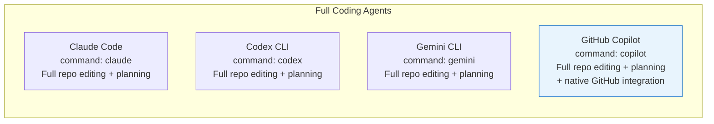
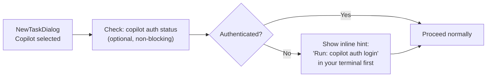

# GitHub Copilot CLI Agent — Implementation Plan

**Date:** 2026-03-01
**Depends on:**
- `2026-03-01-windows-powershell-evaluation.md`
- `2026-03-01-windows-powershell-plan.md`

## Overview

Add GitHub Copilot CLI (`copilot`) as a first-class coding agent in Parallel Code, on equal footing with Claude Code, Codex CLI, and Gemini CLI. `copilot` is a full agentic coding assistant — it plans, edits code, runs tests, manages PRs, and iterates on tasks autonomously — installed as a standalone binary via npm:

```sh
npm install -g @github/copilot
```

It runs natively on **macOS, Linux, and Windows** without requiring any intermediate tool.

---

## What is the Copilot CLI?

`copilot` (`@github/copilot`) is GitHub's standalone terminal-based AI coding agent, generally available as of 2026. It is **not** a shell command generator — it is a fully autonomous coding agent with the same capabilities as the other agents in Parallel Code:

| Capability | `copilot` | `claude` | `codex` | `gemini` |
|---|---|---|---|---|
| Autonomous code editing | ✅ | ✅ | ✅ | ✅ |
| Multi-step planning | ✅ | ✅ | ✅ | ✅ |
| Test execution | ✅ | ✅ | ✅ | ✅ |
| GitHub integration (PRs, issues) | ✅ native | via tools | via tools | via tools |
| Resume session | `--continue` | `--continue` | `resume --last` | `--resume latest` |
| Skip permissions | `--yolo` | `--dangerously-skip-permissions` | `--full-auto` | `--yolo` |

Authentication is performed once via the first-run wizard or `/login`; credentials are stored in `~/.config/github-copilot/` on Unix and `%APPDATA%\GitHub Copilot\` on Windows. A GitHub Copilot subscription is required.

---

## Agent Taxonomy



---

## Platform Support

`copilot` works natively on all platforms supported by Parallel Code:

| Aspect | macOS | Linux | Windows (WSL2) | Windows (PowerShell) |
|---|---|---|---|---|
| Binary | `copilot` | `copilot` | `copilot` (in WSL2 distro) | `copilot.cmd` |
| Install | `npm i -g @github/copilot` | `npm i -g @github/copilot` | `npm i -g @github/copilot` inside WSL2 | `npm i -g @github/copilot` on Windows |
| Auth store | `~/.config/github-copilot/` | `~/.config/github-copilot/` | `~/.config/github-copilot/` (WSL2) | `%APPDATA%\\GitHub Copilot\\` |
| Works without WSL2? | Yes (N/A) | Yes (N/A) | Requires WSL2 | **Yes** (Phase 2) |
| Copilot subscription | Yes | Yes | Yes | Yes |

macOS and Linux are the primary integration path — the binary is invoked directly with no wrappers, exactly like `claude`, `codex`, and `gemini`.

---

## Implementation

### 1. Add Copilot to `DEFAULT_AGENTS`

**File:** `electron/ipc/agents.ts`

Add the entry to the `DEFAULT_AGENTS` array:

```typescript
{
  id: 'copilot',
  name: 'GitHub Copilot',
  command: 'copilot',
  args: [],
  resume_args: ['--continue'],
  skip_permissions_args: ['--yolo'],
  description: "GitHub's Copilot CLI agent",
},
```

No changes are needed to `AgentDef`, IPC, or the frontend agent-picker. The new entry flows through the existing `listAgents()` → `availableAgents` → `NewTaskDialog` pipeline automatically.

#### Spawning Behaviour Per Platform

```mermaid
flowchart TD
    Spawn["spawnAgent called\ncommand = 'copilot'\nargs = []"] --> Platform{process.platform}

    Platform -- darwin/linux --> UnixPath["Unix branch\npty.spawn 'copilot'\ncwd = POSIX path\n(direct, no wrapper)"]

    Platform -- win32 --> ShellType{shellType}

    ShellType -- wsl2 --> WSL2Path["WSL2 branch\nwsl.exe --cd wslCwd --\nbash -lic 'exec \"$@\"' _ copilot\n(sources .bashrc for copilot on PATH)"]

    ShellType -- pwsh/powershell --> PSPath["PowerShell branch (Phase 2)\npty.spawn 'copilot'\ncwd = Windows path\nno WSL translation\nno bash wrapper"]

    UnixPath --> PTY[PTY session]
    WSL2Path --> PTY
    PSPath --> PTY
```

On macOS and Linux the binary is invoked directly — exactly as `claude`, `codex`, and `gemini` are today. On Windows (WSL2), the existing `bash -lic 'exec "$@"'` wrapper sources `.bashrc`, ensuring `copilot` is on PATH when installed inside the distro.

### 2. Authentication State Detection (Optional Enhancement)

When Copilot is selected in the New Task dialog, the app can optionally pre-check authentication and show a setup hint if not logged in:



**File:** `electron/ipc/agents.ts` — add an optional `checkCopilotAuth(shellType)` helper.

**File:** `src/components/NewTaskDialog.tsx` — display the hint inline under the Copilot option when the auth check fails.

---

## Files to Create / Modify

### New Files

_None._

### Modified Files

| File | Change |
|---|---|
| `electron/ipc/agents.ts` | Add `copilot` entry to `DEFAULT_AGENTS` |
| `electron/ipc/agents.ts` | _(optional)_ Add `checkCopilotAuth(shellType)` helper |
| `src/components/NewTaskDialog.tsx` | _(optional)_ Show auth hint when Copilot selected and auth check fails |

---

## Testing Plan

| Test | Environment | Expectation |
|---|---|---|
| `listAgents()` returns `copilot` entry | Unit | `id='copilot'`, `command='copilot'`, `resume_args=['--continue']`, `skip_permissions_args=['--yolo']` |
| Agent picker shows "GitHub Copilot" | Frontend | Card visible in NewTaskDialog on all platforms |
| `spawnAgent` with `command='copilot'` | macOS | `copilot` invoked directly, POSIX cwd |
| `spawnAgent` with `command='copilot'` | Linux | `copilot` invoked directly, POSIX cwd |
| `spawnAgent` with `command='copilot', shellType='wsl2'` | Windows/WSL2 | `wsl.exe ... bash -lic 'exec "$@"' _ copilot` invoked |
| `spawnAgent` with `command='copilot', shellType='pwsh'` | Windows/PS | `copilot` invoked directly in pwsh PTY, no wsl.exe |
| Resume: `copilot --continue` | Any | Resumes most recent session |
| Skip permissions: `copilot --yolo` | Any | All permissions granted without prompts |

---

## Rollout Sequence

1. **Now (no dependencies):** Add `copilot` to `DEFAULT_AGENTS`. Works immediately on macOS and Linux. Works on Windows via WSL2 when `copilot` is installed inside the distro.
2. **After PowerShell Phase 1–2:** `copilot` becomes available in Windows PowerShell terminals without WSL2.
3. **Optional follow-up:** Add `checkCopilotAuth` helper and NewTaskDialog hint for first-time users.

---

## Open Questions

1. **Model selection:** `copilot` supports `COPILOT_MODEL=<model>` env var to choose between GPT-5, Claude, Gemini, etc. Should the agent-picker expose a model selector, or should users set the env var themselves? Recommend env var for now — consistent with how other agents handle model selection.

2. **GitHub-specific tooling:** `copilot` has native GitHub integration (PRs, issues, Actions) not available in the other agents. This could be surfaced as a tooltip or description differentiator in the UI.

3. **Separate auth per shell on Windows:** A user installing `copilot` both inside WSL2 and natively on Windows will need to authenticate in each environment separately.
