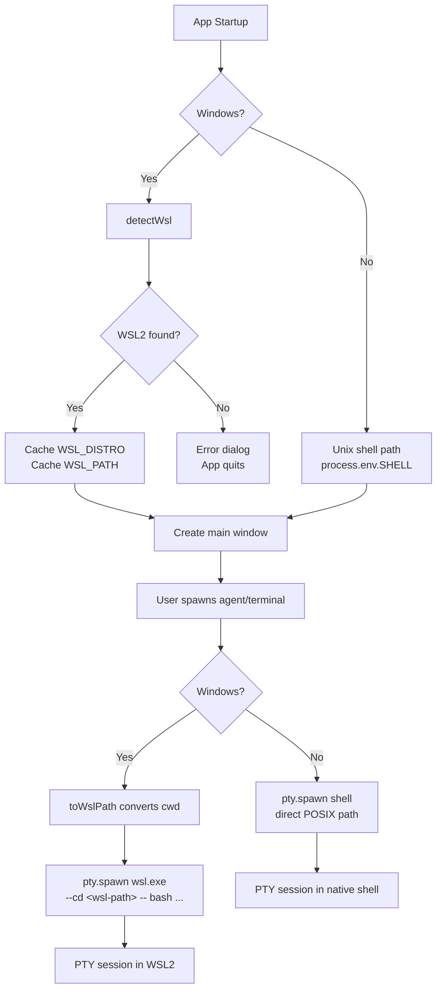
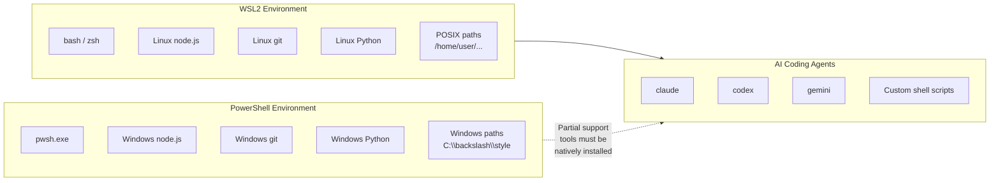
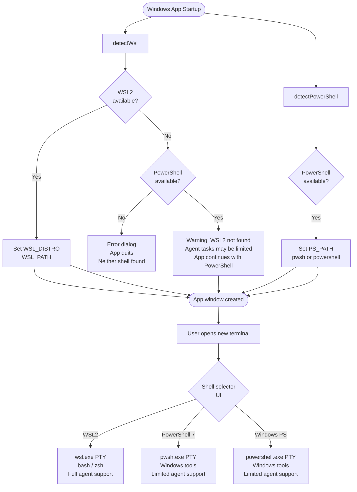

# Windows PowerShell Support — Evaluation

**Date:** 2026-03-01

## Overview

This document evaluates adding Windows PowerShell (pwsh / powershell.exe) as a shell option in Parallel Code for Windows. The app currently requires WSL2 on Windows and delegates all shell execution through `wsl.exe`. The evaluation considers whether PowerShell should be added **in addition to** WSL2, or whether it could **replace** WSL2 as the Windows shell backend.

---

## Current Architecture (WSL2)

On Windows, Parallel Code hard-requires WSL2. At startup, `detectWsl()` probes for `wsl.exe --version` (WSL2 only), identifies the default distro, and caches the WSL login-shell `PATH`. If WSL2 is absent the app shows an error dialog and quits.



### Why WSL2 Was Chosen

| Requirement | WSL2 Answer |
|---|---|
| AI agents (claude, codex, gemini) need Unix tools | Full Linux userspace available |
| npm / node / python in PATH | Installed natively in WSL distro |
| POSIX path semantics | Native |
| git symlinks & file-watching | Works correctly in WSL-native storage |
| Fast I/O for large repos | Native Linux ext4 (`~/` paths) |
| Bash scripts in agent prompts | bash shipped with every WSL distro |

---

## PowerShell Option Analysis

### What PowerShell Brings

**PowerShell 7 (pwsh.exe)** is the modern, open-source, cross-platform shell:

- Ships with Windows 11 (pwsh) and installable on Windows 10
- Supports Unix-style pipelines and many POSIX aliases (`ls`, `cat`, `pwd`)
- Can run `node`, `python`, `git` if they are installed natively on Windows
- `node-pty` supports Windows console PTY natively via `ConPTY` — no WSL bridge needed
- Runs as a first-class Windows process (no VM overhead, instant startup)

**Windows PowerShell 5.1 (powershell.exe)** is the legacy built-in version:

- Present on every Windows installation without any setup
- Older object model; fewer POSIX compatibility aliases
- Still supports `node`, `git`, etc. if installed natively

### Limitations for AI Coding Agents



| Consideration | PowerShell | WSL2 |
|---|---|---|
| Bash script execution | ❌ Not native (needs WSL or Git Bash) | ✅ Native |
| POSIX path syntax | ❌ Windows paths by default | ✅ Native |
| Unix tools (`grep`, `sed`, `awk`) | ❌ Require extra install | ✅ Available immediately |
| node / npm | ✅ If Windows Node installed | ✅ Linux Node in distro |
| git | ✅ If Windows git installed | ✅ Linux git in distro |
| Agent startup time | ✅ Faster (no VM) | ⚠️ Slight WSL init cost |
| File I/O on Windows drives | ✅ Native NTFS speed | ⚠️ `/mnt/c/…` is slow |
| File I/O on WSL-native paths | ❌ UNC path workaround | ✅ Fast on `~/…` |
| Symlinks (npm link, etc.) | ⚠️ Needs Developer Mode | ✅ Works natively |
| `.bashrc` / `.profile` sourcing | ❌ Not applicable | ✅ Full shell startup |
| Cross-platform agent compatibility | ⚠️ Agents may assume bash | ✅ Designed for bash |
| Existing app code changes needed | High | Current default |

### PowerShell Use Cases That WSL2 Cannot Serve Well

1. **Windows-native operations**: Interacting with the Windows registry, COM objects, or system administration tools (`winget`, `choco`, `scoop`).
2. **Windows-native project repos**: Projects stored on NTFS drives (`C:\`) need either PowerShell or WSL2 with `/mnt/c/...` (which is 10–50× slower).
3. **Corporate environments where WSL2 is blocked**: Some enterprise IT policies disable WSL2. PowerShell is always available.
4. **Quick Windows tasks alongside Linux agents**: Users may want a PowerShell tab for Windows tasks while running agents in WSL2 tabs.

---

## Decision Matrix

```mermaid
quadrantChart
    title Shell Option vs. AI Agent Compatibility
    x-axis "Easy to implement" --> "Hard to implement"
    y-axis "Low agent compatibility" --> "High agent compatibility"
    quadrant-1 Best options
    quadrant-2 Safe but costly
    quadrant-3 Avoid
    quadrant-4 Quick wins with tradeoffs
    WSL2 only (current): [0.15, 0.90]
    PowerShell only (replace WSL2): [0.55, 0.30]
    PowerShell + WSL2 (default WSL2): [0.60, 0.92]
    PowerShell as fallback (no WSL2): [0.40, 0.50]
```

### Replace WSL2 with PowerShell — Assessment: ❌ Not Recommended

Replacing WSL2 with PowerShell would mean:

- AI coding agents (claude, codex) would run in a Windows process without guaranteed bash
- Shell script compatibility breaks unless users install Git Bash or Cygwin
- Path handling throughout the codebase (`toWslPath`, `toWinPath`) becomes incorrect
- Every user would need Windows-native `node`, `git`, `python` installed and in PATH
- Major regression for the core use case (autonomous AI coding)

### Keep WSL2 Only — Assessment: ⚠️ Acceptable Short Term, Limiting Long Term

- Blocks users in WSL2-restricted enterprise environments
- No way to run Windows-native tools (winget, powershell scripts) from within the app
- Misses a meaningful segment of Windows users who do not need/want a full Linux distro

### Add PowerShell In Addition to WSL2 — Assessment: ✅ Recommended

This is the recommended approach:

- **WSL2 remains the default** for all agent execution on Windows (no regression)
- **PowerShell is an opt-in additional shell** for new terminals
- The WSL2 requirement can be **relaxed to a strong recommendation** rather than a hard gate if PowerShell is detected, allowing the app to start without WSL2 but with reduced functionality
- Enables **Windows-native workflows** alongside Linux agent tasks
- Unblocks **enterprise users** where WSL2 is restricted

---

## Recommendation Summary



### Key Decisions

1. **PowerShell added alongside WSL2** — not a replacement.
2. **WSL2 is still the recommended shell** for running AI coding agents.
3. **WSL2 requirement softened**: app can start with only PowerShell, but shows a persistent banner explaining that AI agents work best with WSL2.
4. **Shell selection per terminal**: users pick their shell when opening a new terminal tab.
5. **No path conversion needed for PowerShell**: Windows paths are passed as-is to `node-pty`.

---

## Technical Constraints

### node-pty on Windows with PowerShell

`node-pty` supports Windows natively via **ConPTY** (Windows 10 1809+). Spawning `pwsh.exe` or `powershell.exe` directly does not require any WSL bridge:

```typescript
// PowerShell spawn — no wsl.exe wrapper needed
pty.spawn('pwsh.exe', [], {
  name: 'xterm-256color',
  cols: 80, rows: 24,
  cwd: 'C:\\Users\\user\\project',  // Windows path, no translation
  env: { ...process.env, TERM: 'xterm-256color' }
})
```

### Path Handling

| Context | WSL2 | PowerShell |
|---|---|---|
| `cwd` passed to `pty.spawn` | Windows path (`C:\`) for node-pty; WSL path via `--cd` flag | Windows path directly |
| Paths shown in UI | Should be WSL POSIX paths | Windows paths (backslash) |
| Dialog-opened paths | Run through `toWslPath()` | No conversion needed |
| `toWinPath` / `toWslPath` | Required | Not needed |

### Environment Variables

PowerShell inherits the full Windows environment. Unlike WSL2 (which needs `WSL_PATH` injected), PowerShell's PATH already contains Windows-installed tools. No custom PATH injection is needed.

### ANSI / VT100 in PowerShell

Both PowerShell 7 and Windows PowerShell support VT100 ANSI escape codes via ConPTY. The existing `xterm-256color` terminal emulator works without changes.

---

## Risk Assessment

| Risk | Likelihood | Impact | Mitigation |
|---|---|---|---|
| AI agents fail in PowerShell (no bash) | High | Medium | WSL2 remains default; PowerShell clearly labelled "limited agent support" |
| node-pty ConPTY issues on older Windows | Low | Medium | Require Windows 10 1809+ (ConPTY minimum) |
| Path separator bugs in PowerShell mode | Medium | Medium | Separate code path; no WSL path translation applied |
| Enterprise users bypass WSL2 requirement | Low | Low | Warning banner explains agent limitations |
| Increased maintenance surface | Medium | Low | PowerShell detection is simpler than WSL2 detection |

---

## Files Affected by This Change

See the companion implementation plan document for full details.

| Area | Current | Change |
|---|---|---|
| `electron/lib/wsl.ts` | WSL2 detection | No change — kept as-is |
| `electron/lib/powershell.ts` | Does not exist | New: PowerShell detection |
| `electron/ipc/pty.ts` | WSL2 branch for Windows | Add PowerShell branch |
| `electron/main.ts` | Hard-require WSL2 | Soften to recommendation |
| `src/store/` | No shell selection | Add shell preference state |
| `src/components/` | No shell picker | Add shell selector to new-terminal UI |
