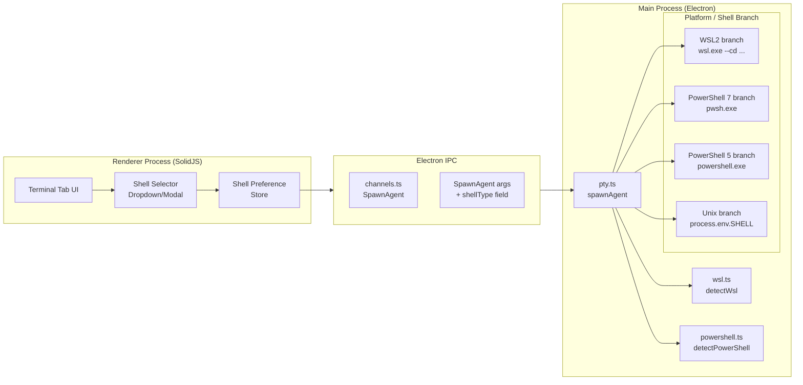
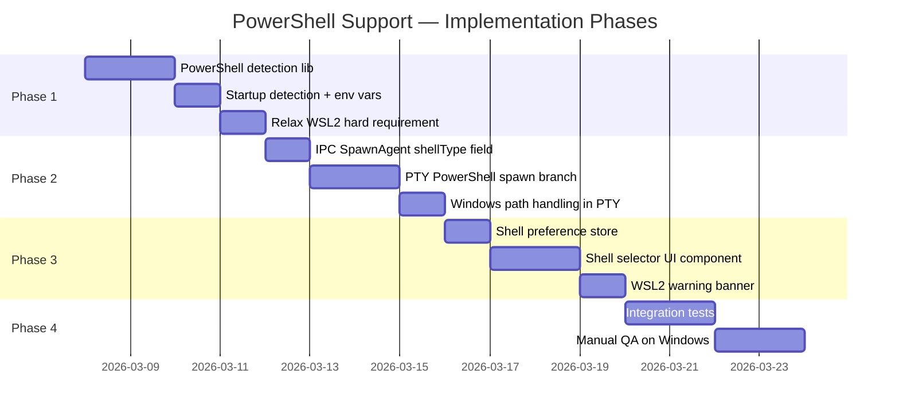
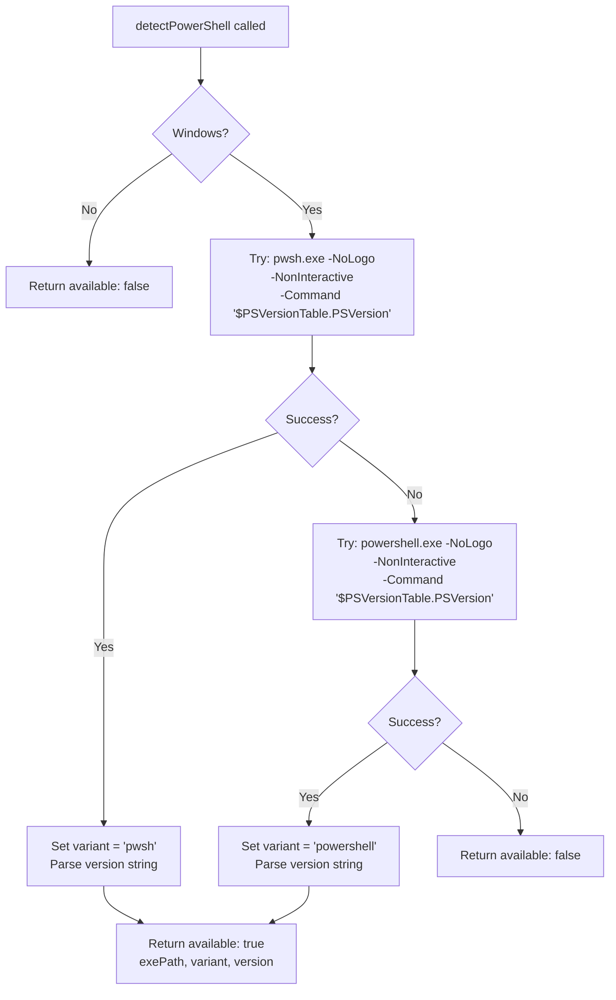
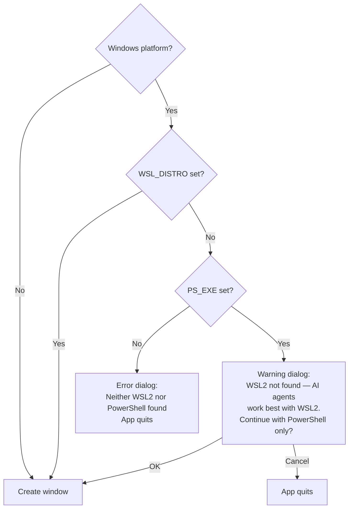
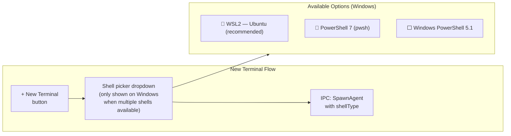
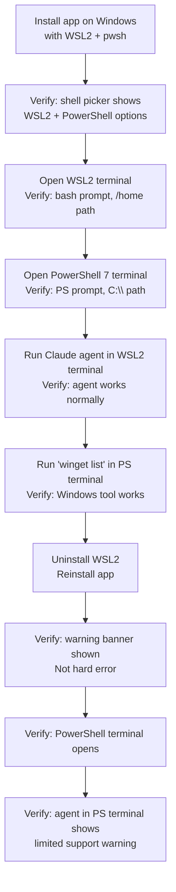

# Windows PowerShell Support — Implementation Plan

**Date:** 2026-03-01
**Depends on:** `2026-03-01-windows-powershell-evaluation.md`

## Summary

Add PowerShell (pwsh / powershell.exe) as an optional shell alongside the existing WSL2 backend on Windows. WSL2 remains the recommended shell for AI agent tasks. PowerShell enables Windows-native workflows and unblocks enterprise users where WSL2 is restricted.

---

## Architecture Overview



---

## Phase Overview



---

## Phase 1 — Detection & Startup

### 1.1 Create `electron/lib/powershell.ts`

New file alongside `wsl.ts`. Detects PowerShell availability and which version is preferred.

```typescript
// electron/lib/powershell.ts

export interface PowerShellInfo {
  available: boolean;
  /** Absolute path to the preferred PowerShell executable */
  exePath: string;
  /** 'pwsh' (PowerShell 7+) | 'powershell' (Windows PowerShell 5.1) | '' */
  variant: 'pwsh' | 'powershell' | '';
  version: string;
}

/**
 * Detects whether PowerShell is available on Windows.
 * Prefers PowerShell 7 (pwsh.exe) over Windows PowerShell 5.1 (powershell.exe).
 * Safe to call on macOS/Linux — returns { available: false } immediately.
 */
export function detectPowerShell(): PowerShellInfo { ... }
```

Detection flow:



### 1.2 Update `electron/main.ts` — `fixPath()`

Extend `fixPath()` to also call `detectPowerShell()` and cache results:

```typescript
// In fixPath(), after detectWsl():
if (process.platform === 'win32') {
  const wsl = detectWsl();
  const ps = detectPowerShell();

  if (wsl.available) {
    process.env.WSL_DISTRO = wsl.distro;
    // WSL_PATH set as side-effect of detectWsl()
  } else {
    process.env.WSL_DISTRO = '';
  }

  if (ps.available) {
    process.env.PS_EXE  = ps.exePath;     // e.g. "pwsh.exe"
    process.env.PS_VARIANT = ps.variant;  // 'pwsh' | 'powershell'
    process.env.PS_VERSION = ps.version;  // e.g. "7.4.1"
  }
}
```

### 1.3 Relax the Hard WSL2 Requirement

Change the startup guard from a hard quit to a conditional:



**Before (hard requirement):**
```typescript
if (process.platform === 'win32' && !process.env.WSL_DISTRO) {
  // show error and quit
}
```

**After (soft requirement when PowerShell available):**
```typescript
if (process.platform === 'win32' && !process.env.WSL_DISTRO && !process.env.PS_EXE) {
  // neither shell found — hard error and quit
} else if (process.platform === 'win32' && !process.env.WSL_DISTRO) {
  // only PowerShell found — warn user, allow continue
}
```

---

## Phase 2 — PTY Spawning

### 2.1 Add `shellType` to SpawnAgent IPC Args

Extend the `SpawnAgent` payload to carry the desired shell:

```typescript
// electron/ipc/pty.ts — spawnAgent args
args: {
  taskId: string;
  agentId: string;
  command: string;
  args: string[];
  cwd: string;
  env: Record<string, string>;
  cols: number;
  rows: number;
  shellType?: 'wsl2' | 'pwsh' | 'powershell' | 'native'; // new field, default 'wsl2' on Windows
  onOutput: { __CHANNEL_ID__: string };
}
```

### 2.2 Add PowerShell Branch in `spawnAgent`

```mermaid
flowchart TD
    Call[spawnAgent called] --> Platform{process.platform}
    Platform -- linux/darwin --> Unix[Use process.env.SHELL\nor /bin/sh]
    Platform -- win32 --> ShellType{args.shellType\nor default}

    ShellType -- wsl2 --> WSL2[Existing WSL2 branch\nwsl.exe --cd wslCwd ...]
    ShellType -- pwsh --> PS7["pwsh.exe branch\nSpawn: pwsh.exe -NoLogo\n-NonInteractive is OFF\n(PTY needs interactive)"]
    ShellType -- powershell --> PS5[powershell.exe branch\nSame pattern as pwsh]
    ShellType -- native --> Unix

    PS7 --> PSCommon[Common PowerShell setup:\ncwd = Windows path (no translation)\nPATH = process.env.PATH\nno WSL_PATH injection]
    PS5 --> PSCommon
    PSCommon --> PTYSpawn[pty.spawn with ConPTY]
    WSL2 --> PTYSpawn
    Unix --> PTYSpawn
```

**Key differences in the PowerShell branch vs WSL2 branch:**

| Aspect | WSL2 Branch | PowerShell Branch |
|---|---|---|
| `command` | `wsl.exe` | `pwsh.exe` or `powershell.exe` |
| `spawnArgs` | `['--cd', wslCwd, '--', ...]` | `['-NoLogo', '-NoExit', '-Command', '...']` for shell; direct for agent |
| `cwd` | `process.env.USERPROFILE` (node-pty on Windows requires a valid Windows path; actual WSL working directory is set via the `--cd` flag passed to wsl.exe) | Actual Windows project path |
| Path translation | `toWslPath(args.cwd)` | None — `args.cwd` used as-is |
| PATH injection | `process.env.WSL_PATH` | `process.env.PATH` (Windows native) |
| Agent wrapping | `bash -lic 'exec "$@"'` | Direct spawn or `pwsh.exe -Command` |

### 2.3 Path Handling in PowerShell Mode

No `toWslPath` / `toWinPath` conversion is needed for PowerShell. The renderer already provides Windows-style paths from the file dialog on Windows. However, a guard must be added to skip WSL path translation when `shellType` is `pwsh` or `powershell`.

```typescript
// In spawnAgent, Windows branch:
if (shellType === 'wsl2') {
  // existing WSL2 path
  cwd = toWslPath(args.cwd || process.env.HOME || '/');
  command = 'wsl.exe';
  // ...
} else {
  // PowerShell path — use Windows paths directly
  cwd = args.cwd || process.env.USERPROFILE || 'C:\\';
  command = process.env.PS_EXE || 'pwsh.exe';
  spawnArgs = ['-NoLogo'];   // interactive shell; agent wrapping TBD
}
```

---

## Phase 3 — Frontend Shell Selection

### 3.1 Shell Preference State

Add shell preference to the app store. This allows per-terminal selection.

```typescript
// src/store/types.ts (addition)
export interface ShellPreference {
  /** Shell to use for new terminals. 'auto' picks WSL2 if available, else PowerShell. */
  default: 'auto' | 'wsl2' | 'pwsh' | 'powershell' | 'native';
}
```

### 3.2 Shell Selector Component



The shell picker is **only shown on Windows when more than one shell is detected**. On macOS/Linux the existing behavior (use `SHELL`) is unchanged.

### 3.3 WSL2-Not-Found Warning Banner

When the app starts with only PowerShell (no WSL2), show a persistent dismissible banner inside the app:

```
⚠️  WSL2 not detected — AI agents (Claude, Codex, etc.) work best in a WSL2 
    Linux environment. PowerShell terminals are available but have limited 
    agent compatibility.  [Install WSL2 ↗]  [Dismiss]
```

---

## Phase 4 — Testing & QA

### 4.1 Unit Tests

| Test | Description |
|---|---|
| `detectPowerShell` returns `available: false` on macOS/Linux | Smoke test for cross-platform safety |
| `detectPowerShell` correctly identifies `pwsh` vs `powershell` | Unit test with mocked `execFileSync` |
| `spawnAgent` uses correct command for each `shellType` | Unit test with mocked `node-pty` |
| WSL2 path conversion not called in PowerShell mode | Assert `toWslPath` not invoked |
| Startup guard: app continues when PS available, no WSL2 | Integration test |

### 4.2 Manual QA Checklist (Windows)



---

## Files to Create / Modify

### New Files

| File | Purpose |
|---|---|
| `electron/lib/powershell.ts` | PowerShell detection: `detectPowerShell()` |
| `docs/plans/2026-03-01-windows-powershell-evaluation.md` | This evaluation (companion doc) |

### Modified Files

| File | Change |
|---|---|
| `electron/main.ts` | Call `detectPowerShell()` in `fixPath()`; soften WSL2 hard-quit to conditional |
| `electron/ipc/pty.ts` | Add `shellType` arg; add PowerShell spawn branch; skip path translation for PS |
| `electron/ipc/channels.ts` | No new channels needed (shellType is part of existing SpawnAgent payload) |
| `src/store/types.ts` | Add `ShellPreference` to app state type |
| `src/store/core.ts` | Initialize shell preference state |
| `src/components/` | Add shell selector to new-terminal UI (Windows only, multi-shell only) |

---

## Backwards Compatibility

- **macOS / Linux**: No code path changes. The PowerShell branch is gated by `process.platform === 'win32'`.
- **Windows with WSL2 only**: Default `shellType` remains `wsl2`. Existing behaviour is identical.
- **Windows with both WSL2 + PowerShell**: New shell selector appears in UI. Default is still WSL2.
- **Windows with PowerShell only (no WSL2)**: App starts with warning; PowerShell terminal available; agent execution discouraged but not blocked.

---

## Dependencies

No new npm packages are required. `node-pty` already supports Windows ConPTY. `execFileSync` from Node.js builtins is used for detection (same as `wsl.ts`).

---

## Open Questions

1. **Agent execution in PowerShell**: Should the app _block_ or merely _warn_ when a user tries to run an AI agent (claude, codex) in a PowerShell terminal? A warning-only approach is more permissive; some agents may work fine if Windows tools are installed.

2. **Profile sourcing in PowerShell**: Should the PTY spawn include `-NoProfile` (faster startup) or source the user's `$PROFILE` (consistent environment, matches WSL2's `.bashrc` sourcing approach)? Sourcing the profile can cause startup failures if `$PROFILE` has errors. The code examples in section 2.2 use `-NoLogo` only (profile sourced by default); they are provisional pending this decision. The recommended default is to **source the profile** (omit `-NoProfile`) so that user PATH extensions added in `$PROFILE` (e.g. scoop, volta, fnm) are available inside the PTY.

3. **Minimum Windows version**: ConPTY requires Windows 10 1809 (build 17763). Should this be documented/enforced?

4. **PowerShell on macOS/Linux**: `pwsh` is available on these platforms too. Out of scope for this plan (native `SHELL` is already used there), but worth noting for future unification.
