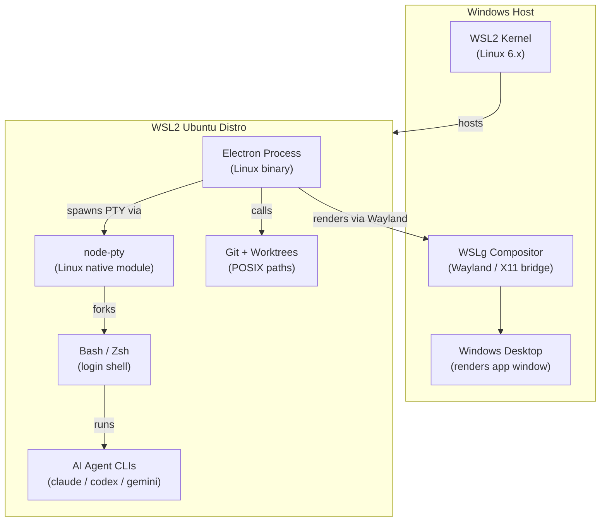
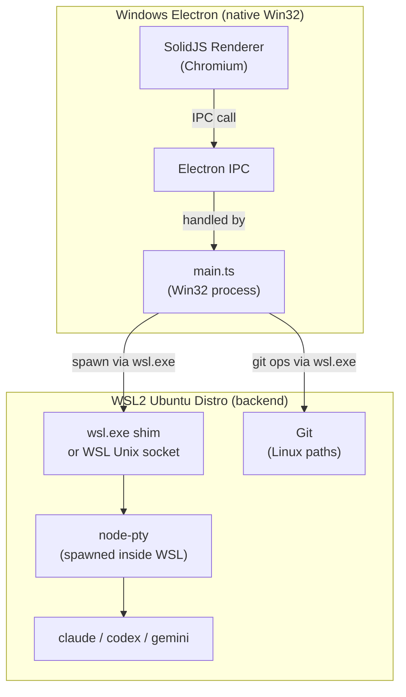
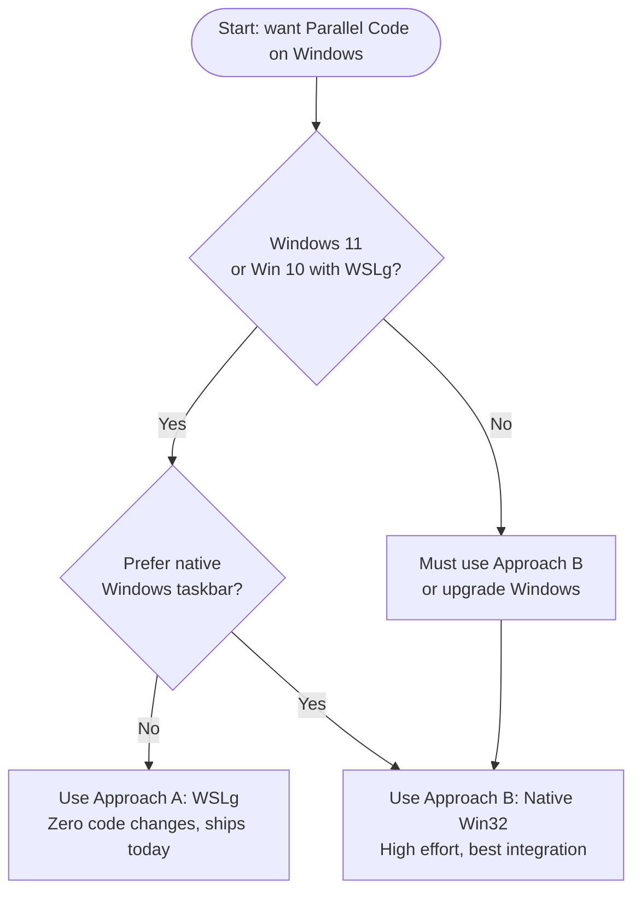

# Porting Parallel Code to Windows via WSL

This directory contains analysis and guides for running **Parallel Code** on Windows using the Windows Subsystem for Linux (WSL).

---

## Background

Parallel Code is built on Electron with a Node.js backend that relies on:

- **node-pty** — a native addon that spawns POSIX pseudo-terminals
- **Git worktrees + symlinks** — rely on POSIX filesystem semantics
- **AI CLI agents** (Claude Code, Codex, Gemini CLI) — written for POSIX shells
- **Shell PATH resolution** — login-shell sourcing via `-ilc` flags

All of these are Linux/macOS-native. Running them on bare Windows would require significant rewrites. WSL lets us avoid most of that by providing a real Linux environment inside Windows.

---

## Two Approaches

| Approach | Effort | Windows integration | Supported Windows | Recommended for |
|----------|--------|---------------------|-------------------|-----------------|
| **[A] WSLg (Linux app in WSL2)](#approach-a-wslg)** | None / minimal | Medium | Windows 11 or Win 10 + WSLg preview | Most users today |
| **[B] Native Windows Electron + WSL backend](#approach-b-native-windows-electron-with-wsl-backend)** | High | Best | Windows 10+ | Power users, future distribution |

---

## Approach A: WSLg

Run the existing **Linux build of Parallel Code inside WSL2** using [WSLg](https://github.com/microsoft/wslg) (Windows Subsystem for Linux GUI). WSLg ships by default with Windows 11 and as an optional feature on Windows 10 (build 21362+).

No code changes are required. The Linux AppImage or the source dev server runs as-is inside WSL2; WSLg forwards the display to Windows via a built-in Wayland/X11 compositor.

### System Architecture (Approach A)

### What changes (Approach A)

- **None** for source code.
- The `install.sh` script detects Linux, which is correct inside WSL.
- See **[wslg-setup-guide.md](./wslg-setup-guide.md)** for the step-by-step setup.

---

## Approach B: Native Windows Electron with WSL Backend

Run **Electron natively on Windows** (using the Win32 renderer) but proxy all shell/PTY/git operations to a WSL2 distro. This gives the best Windows shell-integration (taskbar pinning, native notifications, no WSLg requirement) but requires meaningful code changes.

### System Architecture (Approach B)

### What changes (Approach B)

This approach requires code changes in several areas. See **[windows-native-approach.md](./windows-native-approach.md)** for full details.

| Area | File | Change |
|------|------|--------|
| Shell detection | `electron/main.ts` | `fixPath()` — detect WSL and resolve PATH via `wsl.exe` |
| PTY spawning | `electron/ipc/pty.ts` | Default shell falls back to `wsl.exe` on Win32 |
| Git execution | `electron/ipc/git.ts` | `execFile('git', …)` → `execFile('wsl', ['git', …])` or use Git for Windows with UNC paths |
| Build config | `package.json` | Add `win32` target to electron-builder |
| Path validation | `electron/ipc/register.ts` | Accept both `/` and `\` absolute paths |
| Install script | `install.sh` | Add WSL detection branch |

---

## Decision Guide

---

## Key Compatibility Notes

### node-pty

`node-pty` uses native C++ bindings to `openpty`/`forkpty`. On Linux inside WSL, this works unchanged. For native Win32, `node-pty` supports Windows via `ConPTY` (available since Windows 10 1903), so a Win32 build is feasible — but the API surface is the same and no Parallel Code source changes are needed for PTY itself.

### Git Worktrees + Symlinks

Git worktrees rely on symlinks for the `node_modules` shortcut. Inside WSL, symlinks work normally. On native Windows (NTFS), symlinks require **Developer Mode** to be enabled or administrator elevation. This is a real concern for Approach B and should be documented in a user-facing warning.

### Path Separators

Parallel Code uses `path.join` and `path.isAbsolute` from Node.js. On Win32 these return Windows-style paths (`C:\Users\…`), while WSL paths are `/home/user/…`. Approach B must bridge this — one solution is to use the `\\wsl$\Ubuntu\…` UNC namespace from Windows to refer to files inside WSL.

### AI Agent CLI Availability

Claude Code, Codex CLI, and Gemini CLI must be installed **inside the WSL distro** in both approaches. The `agents.ts` file just records the command names (`claude`, `codex`, `gemini`) — these must be on `$PATH` in the login shell.

---

## See Also

- [wslg-setup-guide.md](./wslg-setup-guide.md) — step-by-step for Approach A
- [windows-native-approach.md](./windows-native-approach.md) — detailed code-change plan for Approach B
