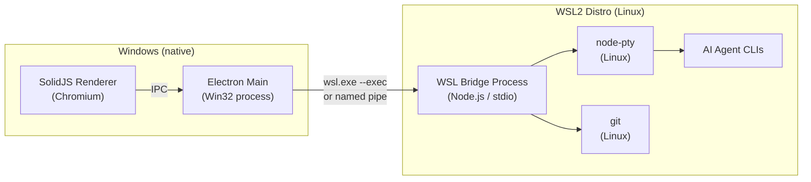
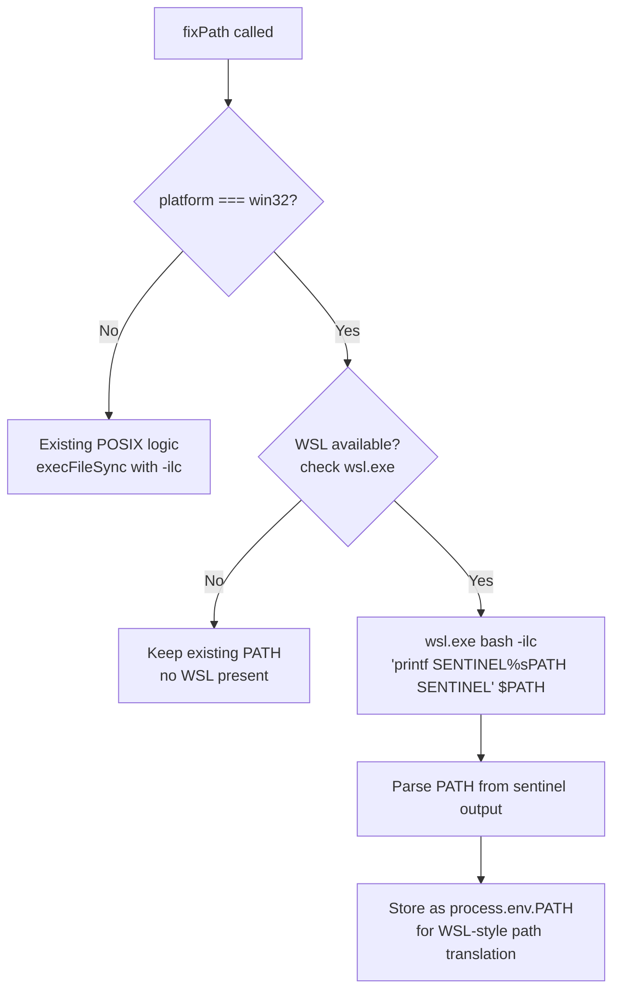
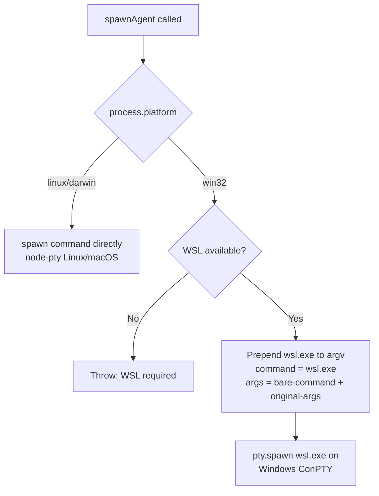
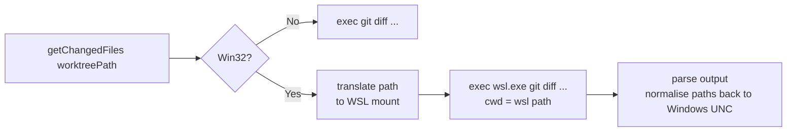
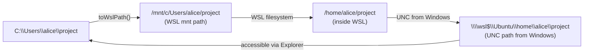

# Native Windows Electron + WSL Backend (Approach B)

This document describes the code changes required to run Parallel Code as a **native Win32 Electron application** while delegating all shell, PTY, and git operations to a WSL2 distro.

> **Status:** Design / planning phase. These are proposed changes, not yet implemented.

---

## Overview

In this approach the Electron renderer and main process run as native Windows processes. All POSIX-dependent operations (PTY, shell, git) are proxied into WSL2 via `wsl.exe` or a Unix-domain socket bridge.



---

## Component-by-Component Change Plan

### 1. `electron/main.ts` — `fixPath()` for Windows/WSL

**Current behaviour:** Exits early on `win32` without resolving the PATH.

**Required change:** On Windows, detect WSL and resolve `$PATH` from the default WSL distro's login shell.



**Proposed code change in `electron/main.ts`:**

```typescript
function fixPath(): void {
  if (process.platform === 'win32') {
    // On Windows, try to resolve PATH from the default WSL distro
    try {
      const sentinel = '__PCODE_PATH__';
      const result = execFileSync(
        'wsl.exe',
        ['bash', '-ilc', `printf "${sentinel}%s${sentinel}" "$PATH"`],
        { encoding: 'utf8', timeout: 5000 },
      );
      const match = result.match(new RegExp(`${sentinel}(.+?)${sentinel}`));
      if (match?.[1]) {
        process.env.WSL_PATH = match[1]; // store separately; used by pty.ts
      }
    } catch {
      // WSL not available — keep existing Windows PATH
    }
    return;
  }
  // ... existing POSIX logic unchanged ...
}
```

---

### 2. `electron/ipc/pty.ts` — Shell Spawning on Windows

**Current behaviour:** Falls back to `process.env.SHELL || '/bin/sh'` which does not exist on Win32.

**Required change:** On Win32, spawn the PTY inside WSL using `wsl.exe` as the executable and the target command as an argument.



**Proposed code change in `electron/ipc/pty.ts`:**

```typescript
// At the top of spawnAgent, after validating `command`:
let spawnCommand = command;
let spawnArgs = args.args;

if (process.platform === 'win32') {
  // Delegate PTY execution to WSL
  spawnCommand = 'wsl.exe';
  spawnArgs = ['--', command, ...args.args];
}

const proc = pty.spawn(spawnCommand, spawnArgs, {
  name: 'xterm-256color',
  cols: args.cols,
  rows: args.rows,
  cwd: toWslPath(args.cwd),   // translate Windows path to WSL path
  env: spawnEnv,
});
```

A helper `toWslPath` converts `C:\Users\foo\project` → `/mnt/c/Users/foo/project` (or the preferred WSL-native path).

---

### 3. `electron/ipc/git.ts` — Git Operations on Windows

**Current behaviour:** `execFile('git', args, { cwd })` — assumes `git` is on the system PATH as a POSIX binary.

**Two sub-options:**

| Sub-option | Pros | Cons |
|------------|------|------|
| **Git for Windows** (Git Bash) | No WSL needed | Symlink support requires Developer Mode; line endings differ |
| **WSL git** (`wsl.exe git …`) | Consistent with PTY; POSIX paths; symlinks work | Requires WSL; path translation needed |

Recommended: **WSL git** for consistency. All `exec('git', …)` calls become `exec('wsl.exe', ['git', ...args])` with CWD translated.



---

### 4. `package.json` — Add `win32` Build Target

Add a `win` section to the `build` configuration:

```json
"win": {
  "target": [
    { "target": "nsis", "arch": ["x64", "arm64"] }
  ],
  "icon": "build/icon.ico"
},
"nsis": {
  "oneClick": false,
  "allowToChangeInstallationDirectory": true
}
```

Also update `asarUnpack` to include the Win32 node-pty prebuilds:

```json
"asarUnpack": [
  "**/node-pty/**"
]
```

(This is already present; the Windows prebuilds are included automatically by node-pty's npm package.)

---

### 5. `electron/ipc/register.ts` — Path Validation for Win32

`validatePath` currently rejects anything that isn't an absolute POSIX path. On Win32 it must also accept Windows absolute paths:

```typescript
function validatePath(p: unknown, label: string): void {
  if (typeof p !== 'string') throw new Error(`${label} must be a string`);
  const isAbsolute =
    path.isAbsolute(p) ||
    (process.platform === 'win32' && /^[A-Za-z]:[/\\]/.test(p));
  if (!isAbsolute) throw new Error(`${label} must be absolute`);
  if (p.includes('..')) throw new Error(`${label} must not contain ".."`);
}
```

---

### 6. `install.sh` — WSL Detection Branch

The install script currently exits on unsupported OS. Add a WSL branch:

```bash
# Detect WSL
if grep -qi microsoft /proc/version 2>/dev/null; then
    echo "WSL detected — using Linux build path"
    OS="Linux"
fi
```

This means WSL users can run `bash install.sh` from their WSL terminal and get the standard Linux `.deb` install. No separate WSL build is needed for Approach A.

---

## Path Translation Reference

When Electron runs natively on Windows and talks to WSL, paths must be translated:



**Recommendation:** Store all git repositories inside the WSL filesystem (`/home/alice/…`) rather than on the Windows mount (`/mnt/c/…`). This avoids the performance penalty of cross-filesystem I/O and eliminates most path-translation complexity.

---

## Symlink Behaviour on Windows

Parallel Code uses `fs.symlinkSync` to link `node_modules` and other directories into each worktree. On Windows NTFS, symlink creation requires either:

1. **Developer Mode** enabled (Settings → Privacy & Security → For developers → Developer Mode), which grants symlink creation to all users; or
2. **Administrator elevation** for the Electron process.

WSL's virtual filesystem (`ext4`) supports symlinks without restriction. This is another reason to prefer keeping repos inside WSL native storage for Approach B.

---

## Effort Estimate

| Task | Complexity | Estimated effort |
|------|------------|-----------------|
| `fixPath()` WSL path resolution | Low | 1–2 hours |
| PTY `wsl.exe` delegation | Medium | 4–8 hours |
| Git `wsl.exe` delegation + path translation | High | 1–2 days |
| `validatePath` Win32 support | Low | 1 hour |
| electron-builder Win32 config + icon | Low | 2–4 hours |
| E2E testing on Windows | High | 1–2 days |
| **Total** | | **~4–6 days** |

---

## Recommended Rollout

1. **Phase 1 (shipped now):** Publish WSLg setup guide — zero code changes, users can run today.
2. **Phase 2:** Add Win32 build target + `fixPath()` WSL detection. Ship a Windows installer that explains WSL is required.
3. **Phase 3:** Implement PTY and git WSL delegation, test on Windows 10 and 11.
4. **Phase 4:** Symlink fallback / Developer Mode detection + user-facing warning.
