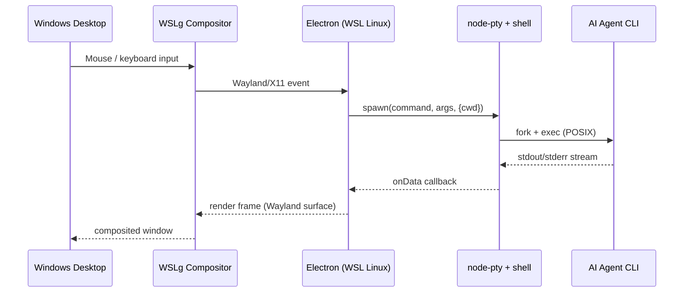

# WSLg Setup Guide (Approach A)

Run the existing **Linux build of Parallel Code** inside WSL2 with WSLg — no code changes required.

---

## Prerequisites

| Requirement | Notes |
|-------------|-------|
| Windows 11 (any edition) **or** Windows 10 build 21362+ with WSLg preview | WSLg is built into Windows 11; for Windows 10 see [microsoft/wslg releases](https://github.com/microsoft/wslg/releases) |
| WSL2 with a Linux distro (Ubuntu 22.04 or 24.04 recommended) | `wsl --install` on a fresh machine installs Ubuntu by default |
| At least 8 GB RAM (16 GB recommended) | WSL2 VM takes ~1–2 GB; Electron + agents take another 2–4 GB |
| Node.js 18+ inside WSL | Install via `nvm` or `fnm` for version management |
| Git 2.28+ inside WSL | Required for worktree support |

---

## Step-by-Step

### 1. Install / Update WSL2

Open **PowerShell as Administrator** and run:

```powershell
wsl --install
# or, if WSL is already installed:
wsl --update
wsl --set-default-version 2
```

Reboot if prompted. WSLg is included automatically on Windows 11.

---

### 2. Verify WSLg is Working

Inside your WSL terminal, run a simple GUI app:

```bash
# Install a minimal test app
sudo apt install -y x11-apps
# Launch it — a clock window should appear on your Windows desktop
xclock
```

If `xclock` appears, WSLg is functional. Close it and continue.

---

### 3. Install Dependencies Inside WSL

```bash
# Node.js via nvm (recommended)
curl -o- https://raw.githubusercontent.com/nvm-sh/nvm/v0.40.1/install.sh | bash
source ~/.bashrc
nvm install 20
nvm use 20

# Git (usually pre-installed)
sudo apt install -y git

# Build tools needed for node-pty native compilation
sudo apt install -y build-essential python3

# (Optional) install AI agent CLIs
# Claude Code
npm install -g @anthropic-ai/claude-code
# Codex CLI
npm install -g @openai/codex
# Gemini CLI
npm install -g @google/gemini-cli
```

---

### 4. Clone and Run Parallel Code

```bash
git clone https://github.com/johannesjo/parallel-code.git
cd parallel-code
npm install
npm run dev
```

The Electron window will open on your Windows desktop via WSLg — it behaves like a native window (taskbar icon, Alt+Tab, etc.).

---

### 5. (Optional) Build and Install the Linux Package

```bash
npm run build
# This produces release/*.AppImage and release/*.deb

# Install the .deb (creates a Start-menu-style launcher inside WSL):
sudo dpkg -i release/*.deb
```

Or run the convenience script:

```bash
bash install.sh
```

To launch the installed app later:

```bash
parallel-code
# or find it in the WSLg app list on the Windows Start menu
```

---

## How WSLg Bridges Linux → Windows



---

## Troubleshooting

### Electron opens but the window is blank / frozen

Run `npm run dev` from a WSL terminal (not PowerShell). Make sure `DISPLAY` or `WAYLAND_DISPLAY` is set:

```bash
echo $DISPLAY        # should print :0 or similar
echo $WAYLAND_DISPLAY # should print wayland-0 or similar
```

If both are empty, WSLg is not active. Run `wsl --update` from PowerShell and restart WSL:

```bash
wsl --shutdown
# then reopen your WSL terminal
```

### node-pty fails to compile

Make sure build tools are installed:

```bash
sudo apt install -y build-essential python3
npm rebuild
```

### AI agent CLIs not found

The agents must be on `$PATH` in your **login shell** inside WSL. Parallel Code sources the login shell with `-ilc` to discover PATH (see `electron/main.ts` → `fixPath()`). If `claude` / `codex` / `gemini` were installed globally via `npm install -g`, make sure your `~/.bashrc` or `~/.zshrc` includes the npm global bin directory in `$PATH`.

Test:

```bash
bash -ilc 'which claude'
```

If that returns a path, Parallel Code will find it too.

### Symlinks for node_modules fail inside a Windows-hosted directory

If your project repo lives on the Windows filesystem (e.g., `/mnt/c/Users/…`), symlinks may not work because the underlying NTFS volume may have `metadata` mount option disabled.

**Solution:** Keep your git repos inside the WSL filesystem (`~/projects/…`). Windows can still access them at `\\wsl$\Ubuntu\home\<user>\projects\…` in Explorer.

---

## Performance Tips

- Store your repositories inside the WSL filesystem (`~/`), not on `/mnt/c/`. I/O is significantly faster (10–50×) inside the WSL virtual disk.
- Set WSL memory limit in `%USERPROFILE%\.wslconfig`:

```ini
[wsl2]
memory=8GB
processors=4
```

- Enable `swap` if you run many agents simultaneously:

```ini
[wsl2]
swap=4GB
```

---

## Uninstalling

To remove the installed package:

```bash
sudo dpkg -r parallel-code
```

To remove the source build:

```bash
rm -rf ~/parallel-code
```
